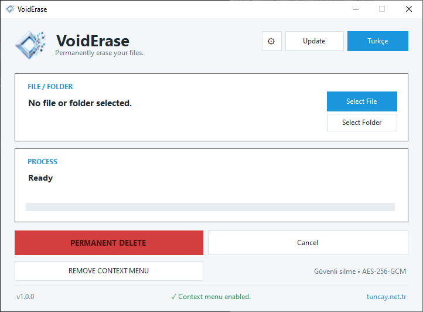

# VoidErase

Secure Windows file/folder destruction utility.

## Version
Current release: **v1.4.0**

## Features
- AES-256-GCM processing with SHA-256 verification
- File and recursive folder selection
- Explorer context menu integration for files and folders
- TR / EN support
- Compact Light UI
- Configurable settings
- Operation summary UI
- GitHub release updater

## Safety
- Windows and Program Files trees are protected by default.
- Source files are deleted only after successful encryption and container verification.
- Failed or inaccessible items prevent unsafe parent-folder cleanup.
- Temporary destruction containers are cleaned up when an operation fails or is cancelled.
- System files are not processed.
- File and folder operations support cancellation without intentionally deleting the original source before verification succeeds.

## ScreenShot


## Build

VoidErase targets **.NET Framework 4.8** and is built for **x64 Windows**. Open `VoidErase.Framework48.slnx` or `VoidErase.Framework48.csproj` in Visual Studio with the .NET Framework 4.8 Developer Pack installed. Alternatively, run the automated Release build script from PowerShell:

```powershell
Set-ExecutionPolicy -Scope Process Bypass
.\Build-Release.ps1 -Clean
```

The automated script reports the version, validates the Release output, and prints the SHA-256 hash. Use `-RunTests` to run any separate test projects and `-CopyToProjectRoot` to copy the final executable to the project root.

The script uses MSBuild when available and falls back to the `dotnet` CLI. It verifies that `bin\\Release\\VoidErase.exe` was produced. The final v1.4.0 Release build has been verified on Windows.

Historical source copies and patch notes are kept under `archive/` and are not part of the active build.

## GitHub updater
Repository: https://github.com/tuncaycandan/VoidErase
Release asset: `VoidErase.exe`

## License

VoidErase is licensed under the GNU General Public License v3.0 (GPL-3.0).

See the [LICENSE](LICENSE) file for the full license text.
